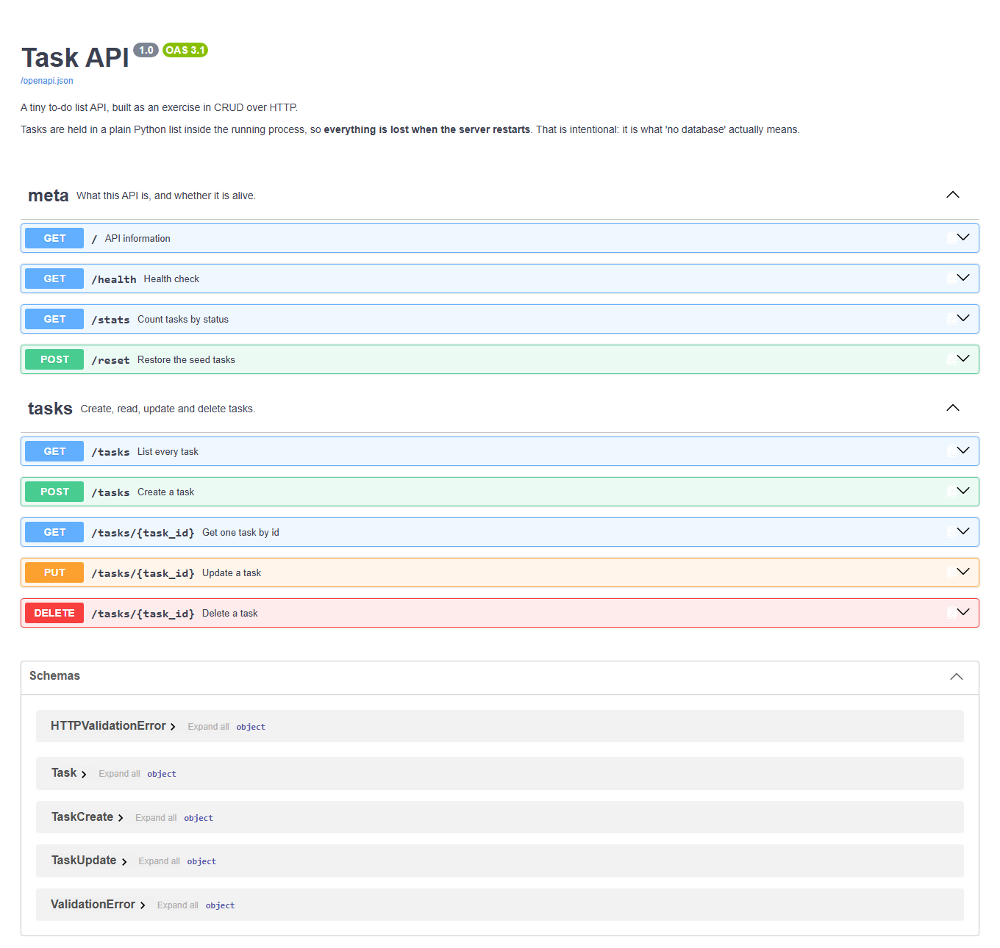

# Task API

A small to-do list API built with **FastAPI**. It does all four CRUD operations — create, read,
update, delete — over HTTP, and documents itself at `/docs`.

There is no database. Tasks live in a plain Python list inside the running process, which means
**everything is lost when the server restarts**. That is deliberate: this project is about learning
what CRUD over HTTP actually looks like, and the disappearing data is the lesson (see
[The mortality experiment](#the-mortality-experiment)).

Built for FlyRank Week 2, Assignment 1.

---

## Install and run

You need **Python 3.10 or newer**. Three commands from a clean checkout:

```bash
python -m venv .venv
.venv/Scripts/pip install -r requirements.txt      # macOS/Linux: .venv/bin/pip
.venv/Scripts/python -m uvicorn main:app --reload  # macOS/Linux: .venv/bin/python
```

The server starts on **http://localhost:8000**. Open **http://localhost:8000/docs** for the
interactive documentation.

`--reload` restarts the server automatically whenever you save a file. Handy while developing —
and, since the task list lives in memory, every reload also wipes your tasks.

---

## Endpoints

| Method | Path | What it does | Success | Errors |
|---|---|---|---|---|
| `GET` | `/` | API name, version, and where to go next | `200` | — |
| `GET` | `/health` | Liveness check for monitoring | `200` | — |
| `GET` | `/tasks` | List every task | `200` | — |
| `GET` | `/tasks?done=true` | List only finished tasks (`false` for unfinished) | `200` | — |
| `GET` | `/tasks?search=milk` | List tasks whose title contains this text (case-insensitive) | `200` | — |
| `GET` | `/tasks/{id}` | Get one task by id | `200` | `404` unknown id |
| `POST` | `/tasks` | Create a task from `{"title": "..."}` | `201` | `400` missing or empty title |
| `PUT` | `/tasks/{id}` | Update `title`, `done`, or both | `200` | `404` unknown id · `400` empty body |
| `DELETE` | `/tasks/{id}` | Delete a task | `204` (no body) | `404` unknown id |
| `GET` | `/stats` | Counts: total, done, open | `200` | — |
| `POST` | `/reset` | Restore the three seed tasks | `200` | — |

A task looks like this:

```json
{ "id": 1, "title": "Read the assignment", "done": true }
```

Errors always look like this:

```json
{ "error": "Task 99 not found" }
```

### A note on the status codes

They are not decoration — each one answers a different question:

- **`200 OK`** — here is what you asked for.
- **`201 Created`** — I made something new, and here it is.
- **`204 No Content`** — it worked, and there is genuinely nothing to send back.
- **`400 Bad Request`** — your request was wrong. Fix it and try again.
- **`404 Not Found`** — I have no such thing. Asking for a task that doesn't exist is an error,
  not an empty answer.

The server also decides the things a client shouldn't: the `id`, and that a new task starts as
`done: false`. Letting clients pick their own ids is how you end up with two tasks sharing one.

---

## It works — real output

Copied straight from a terminal, not retyped:

```
$ curl -i http://localhost:8000/tasks/1
HTTP/1.1 200 OK
date: Tue, 25 Aug 2026 20:07:11 GMT
server: uvicorn
content-length: 50
content-type: application/json

{"id":1,"title":"Read the assignment","done":true}

$ curl -i http://localhost:8000/tasks/99
HTTP/1.1 404 Not Found
date: Tue, 25 Aug 2026 20:07:11 GMT
server: uvicorn
content-length: 29
content-type: application/json

{"error":"Task 99 not found"}

$ curl -i -X POST http://localhost:8000/tasks -H "Content-Type: application/json" -d '{"title": "Buy milk"}'
HTTP/1.1 201 Created
date: Tue, 25 Aug 2026 20:07:11 GMT
server: uvicorn
content-length: 40
content-type: application/json

{"id":4,"title":"Buy milk","done":false}

$ curl -i -X DELETE http://localhost:8000/tasks/4
HTTP/1.1 204 No Content
date: Tue, 25 Aug 2026 20:07:11 GMT
server: uvicorn
```

Note the `204`: no `content-length`, no body. That is what "No Content" is supposed to look like.

### If you're on Windows PowerShell

PowerShell mangles the quotes in `-d '{"title": "Buy milk"}'` before curl ever sees them. Put the
body in a file instead:

```powershell
'{"title": "Buy milk"}' | Set-Content body.json -Encoding utf8
curl.exe -i -X POST http://localhost:8000/tasks -H "Content-Type: application/json" -d "@body.json"
```

Use `curl.exe`, not `curl` — bare `curl` in PowerShell is an alias for `Invoke-WebRequest`, which
takes completely different arguments.

---

## Swagger UI

FastAPI reads the type hints, models and docstrings in `main.py` and generates an OpenAPI
description from them. Swagger UI renders that at **http://localhost:8000/docs** — every endpoint
listed, with example bodies and a **Try it out** button that fires real requests at the running
server. No hand-written docs to drift out of date.



---

## The mortality experiment

Create two tasks, kill the server, start it again, and ask for the list.

**Before the restart** — five tasks:

```json
[{"id":1,"title":"Read the assignment","done":true},
 {"id":2,"title":"Build the API","done":false},
 {"id":3,"title":"Write the README","done":false},
 {"id":4,"title":"Survive a restart","done":false},
 {"id":5,"title":"Remember me after reboot","done":false}]
```

**After the restart** — three:

```json
[{"id":1,"title":"Read the assignment","done":true},
 {"id":2,"title":"Build the API","done":false},
 {"id":3,"title":"Write the README","done":false}]
```

**What happened and why.** Both tasks I created were gone, and the list was back to the three seed
tasks — `/stats` went from `{"total":5,"done":1,"open":4}` to `{"total":3,"done":1,"open":2}`. The
tasks only ever existed as a Python list in the memory of one running process, so when that process
died the operating system reclaimed its memory and the list went with it; restarting ran `main.py`
from the top again, which rebuilt the list from the three hard-coded seeds as if nothing had ever
been added. Nothing was ever written to disk, so there was nothing to load back — which is exactly
the gap a database fills.

---

## Notes on a few decisions

**New ids are `max(existing) + 1`, not `len(tasks) + 1`.** The obvious-looking `len(tasks) + 1`
breaks after a delete: remove task 2 from `[1, 2, 3]` and the length is 2, so the next task is
handed id 3 — which already exists. Verified: delete task 2, create a task, get id 4.

**Errors are `{"error": ...}`, not FastAPI's default `{"detail": ...}`.** An exception handler at
the top of `main.py` reshapes them, so every error in the API looks the same.

**Bad bodies return `400`, not `422`.** FastAPI hands validation failures to Pydantic, which answers
`422`. Since this API promises `400`, `title` is declared optional to Pydantic and checked by hand in
the handler, and a second handler catches anything malformed enough to fail before that code runs.

---

## AI vs me

*Stage 7 (optional) — not attempted yet.*

The exercise is to write the spec for this API from memory, hand it to an AI, and compare what comes
back with what's here. Doing that properly means writing the prompt myself, so this section stays
empty until I do. Everything above was hand-built.

---

## Project layout

```
.
├─ main.py           # the entire API
├─ requirements.txt  # fastapi, uvicorn
├─ .gitignore
├─ README.md
└─ docs/
   └─ swagger-ui.png
```
